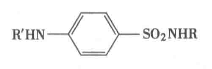

# 绪论

跳过


# 概论

- 药典一共11版

- 每一版的特点
  - 1963年开始分为两部
  - 1985年出现英文
  - 1990年出版《药品红外光谱集》
  - 1995年取消拉丁文，二部改用英文名称
  - 2005年分成三部，第三部收载生物制品
  - 2015年分为四部，一部中药，二部化药，三部生物制品，四部通则和辅料

- 药典凡例

  1. 1→10
     固体溶质1.0g或液体溶质1.0ml加溶剂使成10ml的溶液

  2. 水浴温度
     98-100℃

  3. 冷水
     2-10℃

  4. 冰浴
     0℃

  5. 溶液的滴
     20℃时，1.0ml的水相当于20滴

  6. 阴凉处
     不超过20℃

  7. 凉暗处
     避光并不超过20℃

  8. 恒重
     除另有规定外，系指供试品连续两次干燥或炽灼后称重的差异在0.3mg以下的重量；干燥至恒重的第二次及以后各次称重均应在规定条件下继续干燥1小时后进行；炽灼至恒重的第二次称重应在继续炽灼30分钟后进行。

  9. 精密称定
     称取重量应准确至所取重量的千分之一

  10. 称定
      称取重量应准确至所取重量的百分之一

  11. 易溶
      溶质（1g或1ml）能在溶剂1-10ml中溶解

  12. 溶解
      溶质（1g或1ml）能在溶剂10-30ml中溶解

  13. 原料药的含量百分数
      如未规定上限时，指不超过101.0%

- 美国药典
  - 美国药典今年第几版（2002年第25版，一年一版，老师说今年46版，我查了一下，其实应该是47版）
  - 唯一一个没有作用与用途的药典

# 杂质检查

- 杂质分类与来源
  按来源分类：一般杂质、特殊杂质
  按性质分类：信号杂质、有害杂质
  来源：生产过程、储藏过程（未反应的原料、中间体、副产物）
- 计算例题


- 重金属检查(Pb离子)
  - 硫代乙酰法
    
    - pH=3.5
- 砷盐检查
  
  
  - 醋酸铅棉花的作用
    吸收硫化氢
  - 碘化钾（KI）与二氯化锡（SnCl~2~）的作用
    - 还原五价砷离子（As^5+^）
    - 抑制三氢化锑（SbH~3~）生成
    - 形成锌锡齐，加快反应速率
- 溶液颜色检查（记住有颜色的那三个无机化合物）
  氯化钴标准比色液（红色）、重铬酸钾（黄色）、硫酸铜（蓝色）
- 炽灼残渣700-800℃

# 含量测定方法与验证

不看

# 体内药物分析

- 血样、尿样、唾液、组织，出选择题
- 蛋白的除去方法：
  - 沉淀蛋白法
  - 酸、碱水解法
  - 酶水解法


# 芳酸类非甾体抗炎药

结构式不用画手型

- 水杨酸结构式
  
- 阿司匹林结构式
  

- 布洛芬结构式
  
- 对乙酰氨基酚（扑热息痛）结构式
  

鉴别反应

- 异羟肟酸铁反应
  - 什么样的结构可以用异羟肟酸铁反应鉴别

    （内）酯和（内）酰胺
  
- 三氯化铁（紫堇色）
  - 酚羟基或苯甲酸类

- 重氮化偶合反应（考试的时候要写详细点，分别写出重氮化反应和偶合反应的反应试剂）亚硝酸钠酸性重氮化、β-萘酚碱性偶合
  
  
  - 芳伯氨基或者潜在芳伯氨基（水解后产生）定性鉴别

阿司匹林杂质检查

- 不定项全选（送分）
- 含量测定
  - 酸碱滴定法
    - 直接滴定法、水解剩余滴定法（酯返滴NaOH）、两步滴定法（片剂）
    - 名词解释：中性乙醇（针对指示剂显中性）
      

# 苯乙胺类肾上腺素药物的分析

- 母核结构
  
- 肾上腺素结构
  
- 盐酸多巴胺结构
  
- 盐酸去氧肾上腺素结构
  
- 盐酸麻黄碱结构
  
- 双缩脲反应（选择题） 麻黄碱、伪麻黄碱

  - 系芳环侧链具有氨基醇结构的特征反应。

    盐酸麻黄碱和伪麻黄碱在碱性溶液中与硫酸铜反应，Cu^2+^与仲胺基形成紫堇色配位化合物，加入乙醚后，无水铜配位化合物及其有2个结晶水的铜配位化合物进入醚层，呈紫红色，具有4个结晶水的铜配位化合物则溶于水层呈蓝色。

    与去氧肾上腺素区别——其乙醚层无色，水层蓝色。


特殊杂质检查
- 酮体
  紫外分光光度法（310nm）

含量测定

- 非水滴定
  - 非水碱量法
    冰醋酸，高氯酸滴定剂，结晶紫，醋酸汞（氢卤酸盐时用）
  - 非水酸量法
    乙二胺或二甲基甲酰胺（DMF），甲醇钠做滴定剂，溴酚蓝做指示剂
  
- 亚硝酸钠滴定法
  - 芳伯氨基、芳仲氨基
    ```
    芳伯胺与芳仲胺定性都可以用亚硝酸滴定
    定量只能用芳伯胺，除非芳仲胺可以水解生成芳伯胺
    ```
  
    

# 对氨基苯甲酸酯和酰苯胺类局麻药物的分析

- 盐酸普鲁卡因结构式
  

- 盐酸普鲁卡因特殊杂质检查

  - TLC、HPLC（标准品或自身对照）

    - 系统适用性实验
      - 柱效
      - 分离度
      - 重复性
      - 对称因子（拖尾因子T、不对称因子）

# 二氢吡啶类钙通道阻滞药物的分析

- 母核结构
  
- 硝苯地平结构
  
  - 二氢吡啶环的还原性
    - 氧化还原滴定（铈量法）
  - 硝基
    - 重氮化反应
    - 亚铁→铁反应
  - 含量测定
    - 铈量法
      
      

# 巴比妥及苯并二氮杂卓类镇静催眠药物的分析

- 母核结构
  


- 巴比妥结构
  
- 苯巴比妥结构
  
- 硫喷妥钠结构
  
  

银盐反应（定性定量都可以，AgNO~3~少量一银盐溶解，过量二银盐不溶解）

与铜离子反应（选择题，硫喷妥钠绿色，其他都是紫色）

溴量法（侧链有双键的，司可巴比妥）

含量测定（非水酸量法）

# 吩噻嗪类抗精神病药物的分析

钯离子，定性定量


HPLC、TLC自身对照法

- 针对特殊杂质

- 名词解释要用自己的语言写出核心的点

  一定有一道6分的题

  可以画简图

  - 液相色谱

    - 针对特殊杂质检查找不着杂质的纯品或者不知道杂质的结构
    - 将被测物质配成一系列的高低浓度
    - 高浓度杂质峰面积不得大于低浓度溶液主峰面积，高浓度杂质总面积不能超过低浓度主峰面积的两倍

    参考教材例题： P301示例11-23，11-24

    

    
  
    
  
  - 薄层色谱
  
    - 针对特殊杂质检查找不着杂质的纯品或者不知道杂质的结构
    - 将被测物质配成一系列的高低浓度
    - 供试品溶液除主斑点外的其他斑点与相应的杂质对照标准溶液或系列浓度杂质对照标准溶液的相应主斑点比较，不得更深，或与供试品溶液自身稀释对照溶液或系列浓度自身稀释对照溶液的相应主斑点比较，不得更深。

​		 参考教材例题： P322示例12-17

​		

# 喹啉与青蒿素类抗疟药物的分析

- 青蒿素结构
  
- 双氢青蒿素结构
  
- 青蒿琥酯结构
  
- 蒿甲醚结构
  

绿奎宁反应（选择题）


含量测定

- 硫酸奎宁（看书）⭐️⭐️⭐️⭐️⭐️
  

​		


青蒿素

- 碘化钾鉴别
  
- 异羟肟酸铁鉴别
  

# 莨菪烷类抗胆碱药物的分析

Vitali反应（托烷类）——深紫色，共轭结构阴离子


生物碱显色剂和沉淀试剂

- 碘、碘化钾、碘化铋钾、碘化汞钾

含量测定

- 酸性染料比色法
  - 名词解释
    
  
    
  - 简答题
    - 原理、注意事项（pH选择等5个）。
  
      原理：
      
      
      注意事项：
      
      - 水相最佳pH的选择：如pH过低，抑制了酸性染料的解离，使In-浓度太低，而影响离子对的形成；如pH过高，有机碱药物呈游离状态，使离子对的浓度也很低。
      - 酸性染料的选择及其浓度：定量结合、形成的离子对溶解度高、吸光度高、染料在有机相中溶解度低。浓度适量提高可增加灵敏度，太高了会出现严重的乳化层。
      - 有机溶剂的选择：应选择对有机碱性药物与酸性染料形成的离子对萃取效率高、能与离子对形成氢键、不与或极少与水混溶的有机溶剂作为萃取溶剂。
      - 水分的影响：水相中有过量的有色酸性染料, 水分的混入又可能使有机相浑浊, 从而均影响比色测定的准确性。
      - 酸性染料中的有色杂质：影响测定结果
    
  - 注意事项也可能出选择题

# 维生素类药物的分析

- 维生素C结构


- 维生素C（L-抗血酸）那一节反复看，全是重点，选择题，填空题，⭐️⭐️⭐️⭐️⭐️
  
  
  
  
  
  
  
- 维生素A
  - 三氯化锑鉴别，可定量也可定性
    
- 维生素B1
  - 生物碱的都能用（Vitali，深紫色）
  - 硫色素反应
    
  
- 维生素D
  - 全用HPLC
- 维生素E
  - 含量测定
    - 气相色谱GC

# 甾体激素类药物的分析

- 母核结构（要记编号，没有写编号不得分）
  

- 肾上腺皮质激素

- 17位α醇酮基，四氮唑蓝比色测定

- 带“松”字

除了雌激素以外，都有△4-3-酮基，可用羰基试剂（带“肼”字的）

雌激素的定性鉴别

特殊杂质检查

- 硒元素检查（氧瓶燃烧法）
  有机药物经氧瓶燃烧破坏后，以硝酸溶液(1→30) 为吸收液，用二氨基萘比色法测定硒的含量。

Kober反应

- 雌激素唯一的一个专属性好的反应（黄色→桃红）
- 原理
  

# 抗生素类药物的分析

- β-内酰胺母核结构


- 青霉素母核结构
  

- 头孢菌素母核结构
  

呈色反应

- 羟肟酸铁反应（内酰胺）

氨基糖苷类

- 茚三酮反应（蓝紫色）
- 了解：Molisch、Elson-Morgan、麦芽酚、坂口反应、硫酸盐反应

四环素

- 有酚羟基
- HPLC解决问题
- 酸碱不稳定

# 合成抗菌药物的分析

- 喹诺酮母核结构
  

酸碱两性

- 可以非水碱/酸量法

定性鉴别

- 丙二酸反应
  

- 磺胺类母核结构
  
  - 酸碱两性（非水酸/碱量法，芳伯胺基和磺酰胺基）
  - 芳伯胺（重氮化）
  - 金属离子取代反应（磺酰胺基上的氢离子）

# 制剂分析

重点：片剂、注射液

片剂

- 排除辅料的干扰
  - 硬脂酸镁和糖类的干扰
  
    - 硬脂酸镁
  
      其中镁离子(Mg+)可能干扰基于配合反应原理的药物片剂含量测定方法；而硬脂酸根离子则可能干扰基于酸碱中和反应原理的药物片剂含量测定方法。
  
      - 加屏蔽剂酒石酸屏蔽镁离子
  
    - 糖类
      

注射液

- 抗氧剂的干扰
  - 亚硫酸氢钠
    - 加入屏蔽剂：丙酮或甲醛

计算

- 例题


滴定分析：误差小，准确度高
仪器分析：相对误差偏大，可以痕量分析
